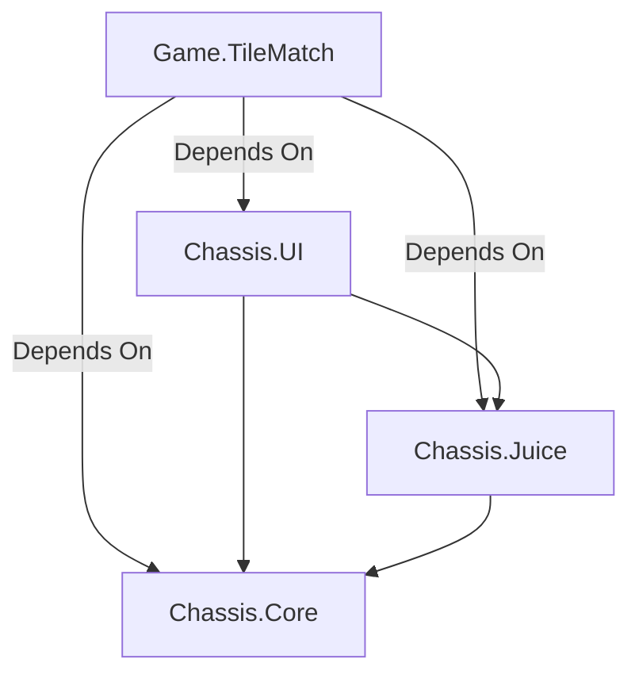
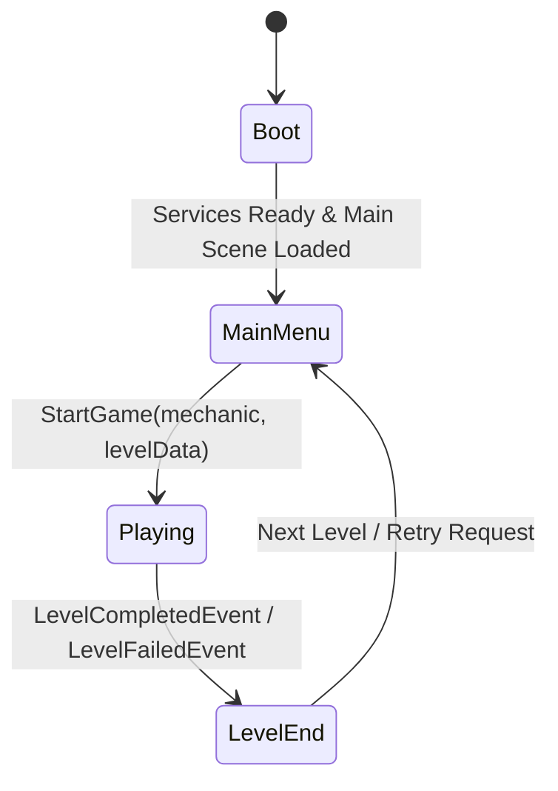

# GameFactory Architecture Documentation

This document outlines the architecture, structural layouts, and design patterns established for the **GameFactoryChassis** framework.

---

## 📐 Overall System Architectural Layers

The project is split strictly into decoupled layers to limit dependencies, enforce modularity, and build a reusable chassis template that can host any game mechanic mod module (`_Game`) without structural modifications to the core.



### 1. `Chassis.Core` (Deep Core Layer)
The engine of the application. Responsible for:
* **Event Dispatching**: Central type-safe `EventBus`.
* **State Machine & Lifecycle**: `GameManager` (transitions `Boot` → `MainMenu` → `Playing` → `LevelEnd`).
* **External Integration wrappers**: Interfaces and dummy setups for Ads (`IAdsProvider`), Analytics (`IAnalyticsProvider`).
* **Game Model Contracts**: Definitions for `IGameMechanic`, `LevelData`, and `LevelResult`.

### 2. `Chassis.Juice` (Polish & Haptics Layer)
Skins particles, audio clips, and haptics. Exposes the `JuicePlayer` mechanism.

### 3. `Chassis.UI` (Visual Controller Layer)
Manages screen states responsive to state machine events. Highly decoupled. Resolves screen visibility through standard event listening.

### 4. `Game.TileMatch` (Active Gameplay Mechanic)
The specific gameplay implementation. Concrete implementation of `IGameMechanic` and level execution flows.

---

## ⚡ Core Communication Mechanism: Struct-based EventBus

To prevent spaghetti reference trees and god object layouts, subsystems communicate via a type-safe generic `EventBus<T>`, using value-type `struct` payloads.

```csharp
// Subscribing to events:
EventBus.Register<LevelCompletedEvent>(OnLevelCompleted);

// Publishing events:
EventBus.Publish(new LevelCompletedEvent { result = myLevelResult });
```

### Supported Architectural Events
1. `GameStateChangedEvent`: Announces transit of state machine modes (Boot, MainMenu, etc.).
2. `LevelCompletedEvent` / `LevelFailedEvent`: Fired by active mechanics to notify GameManager about game matches results.
3. `LevelProgressChangedEvent`: Relayed to update UI layout bars and progression lines.

---

## 🔄 GameManager State Transitions

The core execution transitions using a clean State Machine:



1. **Boot**: Initializes analytics, saves, and ad networks. Activates loader to cache the `Main` gameplay scene.
2. **MainMenu**: Enters main screen visual panel. Waits for player interaction to trigger game starts.
3. **Playing**: Initializes `IGameMechanic`. Ticks the active mechanic in update loops. Listens for outcomes.
4. **LevelEnd**: Performs interstitial ad checks, shows game results, updates streak markers, and coordinates subsequent transitions.

---

## 📊 Analytics Schema & Safety

Analytics are driven by snake_case event identifiers configured as type-safe code keys inside `AnalyticsEvents.cs` to block spelling typos and stray logs:

* `level_start`
* `level_complete`
* `level_fail`
* `ad_offer`
* `ad_shown`
* `ad_reward`

---

## 🚀 Creating New Games on top of Chassis
To instantiate a new gameplay mechanic:
1. Create a sub-folder under `Assets/_Game/YourMechanicGame`.
2. Define a class implementing `IGameMechanic` (Initialize, Start, Tick, End).
3. Connect custom levels data layout to `LevelData.jsonData`.
4. Trigger `LevelCompletedEvent` / `LevelFailedEvent` to announce state resolutions back to `GameManager`.
5. Keep `Assets/_Chassis` folders unmodified.
