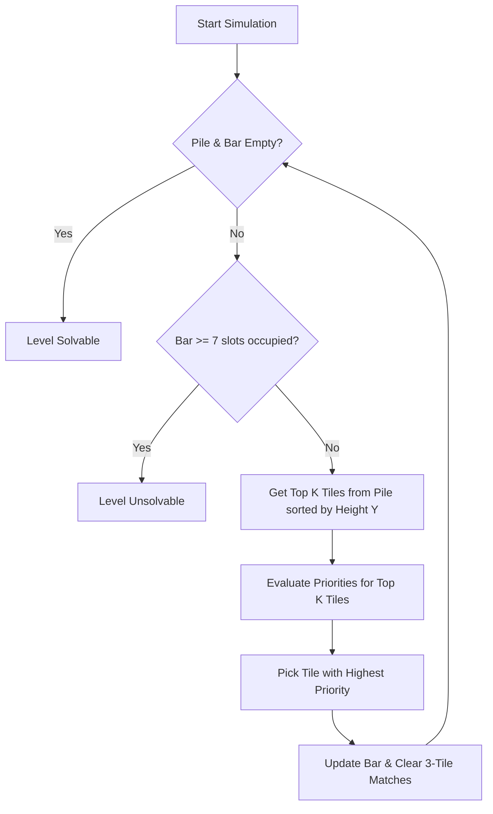

# Level Generator & Solvability Bot Documentation

This document explains the algorithms, parameters, and heuristics used in **GameFactoryChassis** to generate and validate solvable tile-matching levels.

---

## 📈 Difficulty & Curves System (`DifficultyService`)

Level difficulty is managed dynamically based on the current level index. Instead of hardcoding item counts and variety per level, the system uses two customizable **AnimationCurves** located inside `GameConfig`:
1. **Total Objects Curve (`totalObjectsCurve`)**: Defines the target amount of items $N$ to spawn in the level. 
2. **Type Count Curve (`typeCountCurve`)**: Defines the amount of unique colors/types $T$ of items in the level.

### Relaxation Rules (Breath Levels)
To prevent player fatigue, every 5 levels (configured via `breathLevelInterval`) is designated as a **Breath Level** (Nefes Seviyesi). For these levels:
* The total object count is multiplied by `breathLevelMultiplier` (default: `0.6`).
* The unique type count is reduced by `breathLevelTypeReduction` (default: `1`).
* This drops the difficulty spike temporarily to provide a feeling of success and ease.

### Count Constraints
* **Multiple of 3**: The total count $N$ is always rounded and enforced to be a multiple of 3.
* **Triplet Guarantee**: Every unique type $T$ generated must have at least 3 tiles. The generator distributes the remaining objects in chunks of 3 randomly among the types, ensuring there are no odd, matching-impossible tiles.

---

## 🤖 Solvability Bot Heuristics (`SolvabilityBot`)

Because tiles drop dynamically in a 3D box and stack physically, some items might become trapped under other items. A simple logical solver cannot represent this, so the `SolvabilityBot` models physical occlusion:

### Selection Priority (Greedy Decision Heuristics)
The bot simulates the top $K=6$ tiles (the ones sitting highest in the pile along the Y-axis) as clickable. In each step, the bot evaluates these $K$ tiles and picks one based on these priorities:
1. **Priority 3 (Complete Triplets)**: If an available tile matches a pair already in the bar (2 items of same type), pick it to form a match, immediately freeing up slot capacity.
2. **Priority 2 (Pair Up)**: If an available tile matches a single item in the bar (1 item of same type), pick it to pair it up.
3. **Priority 1 (Top Pick)**: If no matches or pairs are possible from the top list, pick the highest tile (highest Y-coordinate) to drill down into the stack.

If the bar reaches 7 slots and no match can be completed from the top $K$ tiles, the bot fails the level validation.

---

## ⚙️ Automated Validation (Seed Fallback)
If the solver bot fails to clear a level with the initial seed, the level generator:
1. Discards the physical layout.
2. Increments the seed value by `1000`.
3. Re-runs the physics spawner placement sequence and bot validation.
4. Repeats up to 100 times until a solvable layout seed is found.
5. Once verified, creates the `LevelData` asset.

---

## 📊 Reference Parameter Table (Level 1 - 30)

Below is an overview of the difficulty parameters calculated dynamically by the curves (assuming baseline Linear curves from time=1 to 100):

| Level | Type | Total Objects ($N$) | Unique Types ($T$) | Breath Level? |
| :---: | :---: | :---: | :---: | :---: |
| **1** | Normal | 18 | 3 | No |
| **2** | Normal | 18 | 3 | No |
| **3** | Normal | 18 | 3 | No |
| **4** | Normal | 18 | 3 | No |
| **5** | **Breath** | 12 | 2 | **Yes** |
| **6** | Normal | 18 | 3 | No |
| **7** | Normal | 21 | 3 | No |
| **8** | Normal | 21 | 3 | No |
| **9** | Normal | 21 | 3 | No |
| **10** | **Breath** | 12 | 2 | **Yes** |
| **15** | **Breath** | 15 | 3 | **Yes** |
| **20** | **Breath** | 18 | 3 | **Yes** |
| **25** | **Breath** | 21 | 3 | **Yes** |
| **30** | **Breath** | 24 | 4 | **Yes** |
